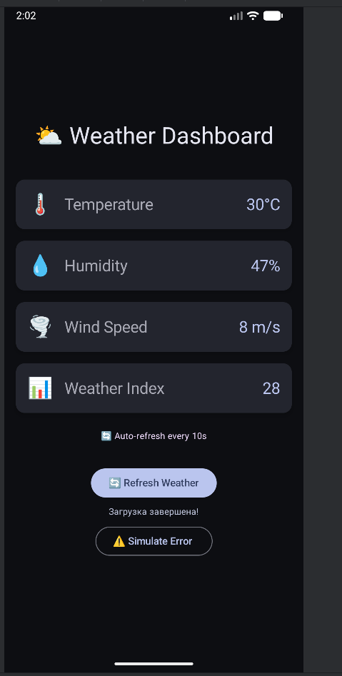

# Лабораторная работа №17-18. Корутины на практике: Метеосводка

---

# Weather Dashboard

Weather Dashboard - это Android-приложение для отображения погодных данных с имитацией загрузки из разных источников. 
Приложение демонстрирует работу корутин в Kotlin: параллельную загрузку данных, обработку ошибок и автоматическое обновление.

---

## Функциональность приложения

- Параллельная загрузка температуры, влажности и скорости ветра
- Отображение индикатора загрузки для каждого параметра
- Кнопка ручного обновленитя данных
- Кнопка симуляции ошибки сети для тестирования
- Автоматическое обновление данных каждые 10 секунд
- Вычисление "индекса погоды" на основе загруженных данных
- Отображение прогресса загрузки

---

## Технологии и библиотеки

- **Kotlin** - язык программирования
- **Jetpack Compose** - декларативный UI
- **Coroutines** - асинхронные операции
- **ViewModel** - управление состоянием
- **StateFlow** - потоки данных

---

## Контрольные вопросы

1. **В чём разница между launch и async?**

    |**Метод**|**Возвращает результат?**|**Когда использовать**|
    |:---:|:-------------------:|:----------------:| 
    |**launch**|Нет (возвращает Job)|Просто выполнить задачу (отправить логи)|
    |**async**|Да (возвращает Deferred<T>)|Нужен результат (загрузить данные)|

   **Пример кода:**
     ```kotlin
     // launch - запустить и забыть (ничего не возвращает)
     viewModelScope.launch {
        loadData() // просто выполняется
     }
     // async - запустить и получить результат
     val result = viewModelScope.async {
        calculateSomething() // вернёт результат
     }.await()
     ```
2. **Что такое `suspend` функция?**
   - `Suspend` функция - может приостановиться и не блокирует поток
   - `Suspend` может вызываться толькор из другой `suspend`-функции или из корутины
   - Потому что `delay()` приостанавливает только корутину, а потом в это время может выполнять другие задачи

3. **Зачем нужны разные диспетчеры?**

   |Dispatcher|Когда использовать|Пример| 
   |:--------:|:----------------:|:----:| 
   |Main|Обновление UI|Изменить текст в Text()|
   |IO|Чтение/запись данных|Загрузка картинки из интернета|
   |Default|Вычисления|Обработка 10000 элементов списка|
    
   - Если выполнить тяжелое вычисление UI зависнет

4. **Что произойдёт, если не обработать исключение в корутине?**
    - Приложение упадет с `FATAL EXCEPTION`
   **Как корректно обрабатывать ошибки?**
    - Использовать `try-catch` для обработки ошибок
   **Зачем нужен `try-catch` внутри `launch`?**
    - Чтобы приложение не крашилось при ошибке, а пользователь видел понятное сообщение

5. **Как работает автоматическая отмена корутин?**
    - `viewModelScope` - это CoroutineScope, привязанный к ViewModel. Он автоматически отменяет все запущенные корутины при вызове `onCleared()`.
    **Корутины отменяются автоматически:**
    - При закрытии экрана
    - При завершении родительской корутины
    - При уничтожении ViewModel

---

## Как запустить проект

- Клонируйте репозиторий:
    ```bash
    git clone <URL - ссылка на репозиторий>
    ```
- Откройте проект в **Android Studio**
- Запустите приложение нажав `Run app` или `Shift + F10`

---

## Скриншоты работы приложения



---

## Автор и дата выполнения

**ФИО:** Гвоздева В.А, Деушев Т.Т  
**Группа:** ИСП-231  
**Дата:** 19.04.2026  
